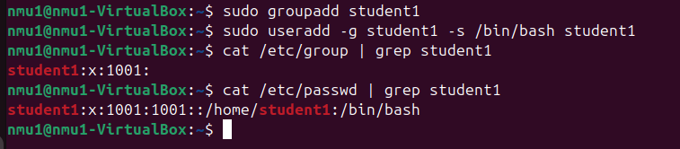
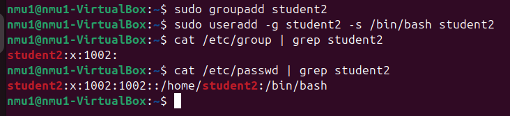
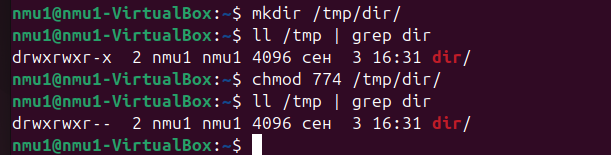
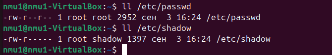

# Домашнее задание к занятию «Linux Hardening»

### Задание 1

- Создайте пользователя `student1` с оболочкой bash, входящего в группу `student1`.
- Создайте пользователя `student2`, входящего в группу `student2`.

*Дайте ответ в виде снимков экрана.*

### Ответ:

------

### Задание 2

- Создайте в общем каталоге, например, /tmp, директорию.
- Назначьте для неё полный доступ со стороны группы `student2` и доступ на чтение всем остальным.

*Дайте ответ в виде снимков экрана.*

### Ответ:

------

### Задание 3

- Определите, какой режим доступа установлен для файлов `/etc/passwd` и `/etc/shadow`.
- Объясните, зачем понадобилось именно два файла.

*Дайте ответ в виде снимков экрана.*

### Ответ:

В Linux файлы /etc/passwd и /etc/shadow имеют разные режимы доступа. Это связано с тем, что эти файлы содержат разную информацию: /etc/passwd — информацию о учётных записях, /etc/shadow — зашифрованную информацию о паролях.
Файл /etc/passwd доступен для чтения обычным пользователям.
Запись в файл имеет только пользователь root или пользователь с привилегиями sudo.

Файл /etc/shadow недоступен для чтения обычным пользователям.
Доступ на чтение имеет только пользователь root. 

------

### Задание 4*

Изучите информацию о SELinux из открытых источников.

Ответьте на вопросы:

- Что из того, что предлагает SELinux, может быть реализовано в стандартном Linux?
- Можно ли установить SELinux поверх существующей ОС Linux?

*Дайте ответ в свободной форме.*

### Ответ:

Возможности SELinux, которые не реализованы в стандартном Linux:
Ограничение доступа для разных процессов. Например, можно разрешить веб-серверу читать и писать файлы, но блокировать другие процессы. 

Проверка условий перед разрешением доступа. Например, веб-сервер может читать и писать файлы только если запрос приходит с доверенного адреса. 

Контроль доступа на основе ролей . Права доступа реализованы в виде ролей, выдаваемых системой безопасности, что улучшает дискреционный контроль доступа. 

SELinux можно установить поверх существующей ОС Linux. 

------
